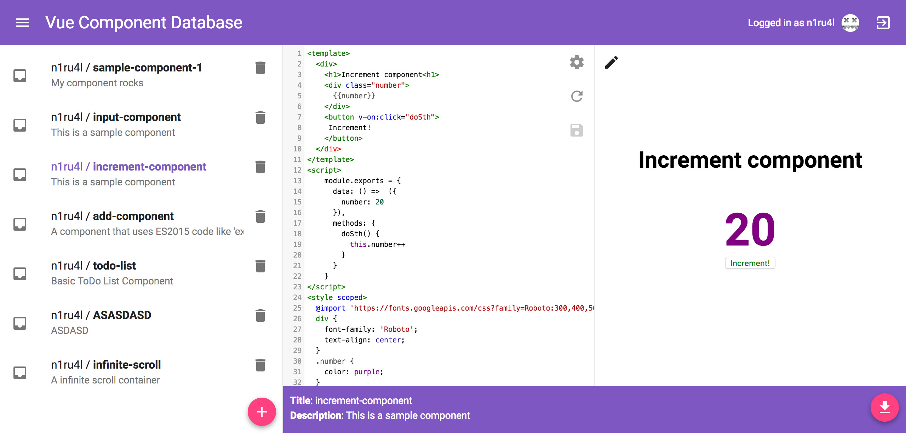

# Vue Component Database



A web application for sharing and editing vue single-file components.

Features:
- GitHub Authentication
- Create and edit Vue Single File Components
- Write ES2015 Code

## Setup

### Manual

Copy `.env.example` to `.env` and adjust the environment variables. (For an explanation of the environment variables scroll down.)

```bash
yarn install
```

```bash
yarn run build
yarn run migrate:db
yarn run start
```

### Docker

:whale: [n1ru4l/vue-component-database](https://hub.docker.com/r/n1ru4l/vue-component-database/)

I recommend to use a `.env` file for configuration. ([Learn more!](https://docs.docker.com/engine/reference/commandline/run/#set-environment-variables--e---env---env-file))

```bash
docker pull n1ru4l/vue-component-database
docker run -d -p 8080:8080 --env-file ./.env vue-component-database
```

### Environment Variables Explanation

#### General

* `APP_PORT` Port of the app (eg. `8080`)

* `APP_HOST` The full host of the app (e.g. `http://localhost:8080`)

#### Github

First you will have to register a new OAuth application with GitHub ([Click here](https://github.com/settings/applications/new))! 

The `Hompage URL` must be equal to you `APP_HOST` variable. The `Authorization callback URL` must be equal to your `APP_HOST` variable + `/login` (e.g. `http://localhost:8080/login`)

* `GITHUB_CLIENT_ID` The Client ID of your OAuth application (some random string)

* `GITHUB_CLIENT_SECRET` The Client Secret of your OAuth application (some more random string)

#### Database

* `DB_CONNECTION` Engine of the connection (Valid options: `sqlite3` or `mysql`)

#### MySQL Only

* `DB_HOST` Host of the database (e.g. `127.0.0.1`)
* `DB_PORT` The port of the database (e.g. `3306`)
* `DB_DATABASE` The name of the database (e.g. `vue_component_db`)
* `DB_USER` The name of the database user (e.g. `john`)
* `DB_PASSWORD` The password of the database user (e.g. `cena`)

##### SQLite3 Only

* `DB_FILENAME` The filename of the sqlite3 database (e.g. `database.sqlite3`)

#### Development Only

* `WEBPACK_DEV_PORT` The port you want to run the webpack dev server (e.g. `4201`)

## Development Stuff


### Running the tests


Execute tests with:

```bash
yarn test
```

## Contributing

1. Fork this repo!

2. Clone your fork!

3. Install dependencies

```bash
yarn install
```

4. Generate the graphql schema `graphql.schema.json` file.

```bash
yarn run generate:schema
```

5. Implement feature!

6. Write Tests! (`yarn test`)

7. Lint the code (`yarn run lint`)

48. Create a pull request :)
